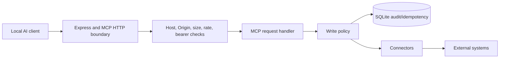

# KORA Architecture

KORA is a local MCP server foundation for governed access to operational systems. Its current job is to establish a safe request boundary before external connectors are added.

## Current components

- Configuration: Zod validates loopback binding, token requirements, integration switches, write switches, and limits.
- HTTP/MCP boundary: Express hosts `/health`, authenticated `/ready`, and authenticated `/mcp`.
- Security middleware: Host and Origin validation, bearer authentication, request-size limits, correlation IDs, and rate limiting.
- MCP adapter: Converts HTTP requests to the MCP server handler.
- Audit foundation: SQLite tables for audit events and idempotency records.
- Logging: Pino structured logging with redaction.

The connector and external-system nodes are a boundary in the current architecture. ConnectWise tools are not currently registered.

## Current versus future

Current: local server, security controls, MCP adapter, configuration, audit schema, and tests.

Future: narrow read-only connectors, explicit authorization for writes, external-system adapters, and independently verified execution workflows.
