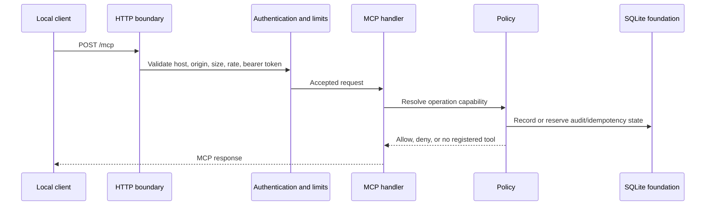

# KORA Data Flow

The current code has no registered ConnectWise tools. The diagram shows the implemented local request boundary and the audit/policy boundary without claiming an external data exchange.

The public `/health` route reports service metadata and enabled integration names. The `/ready` route is authenticated. Both routes are separate from MCP operation execution.
